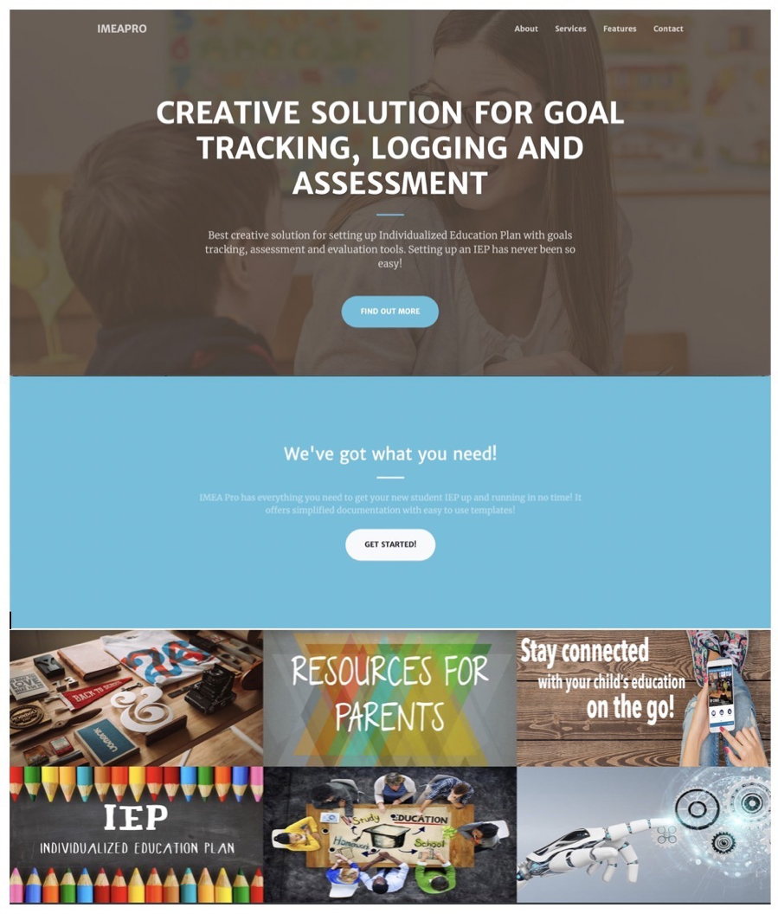
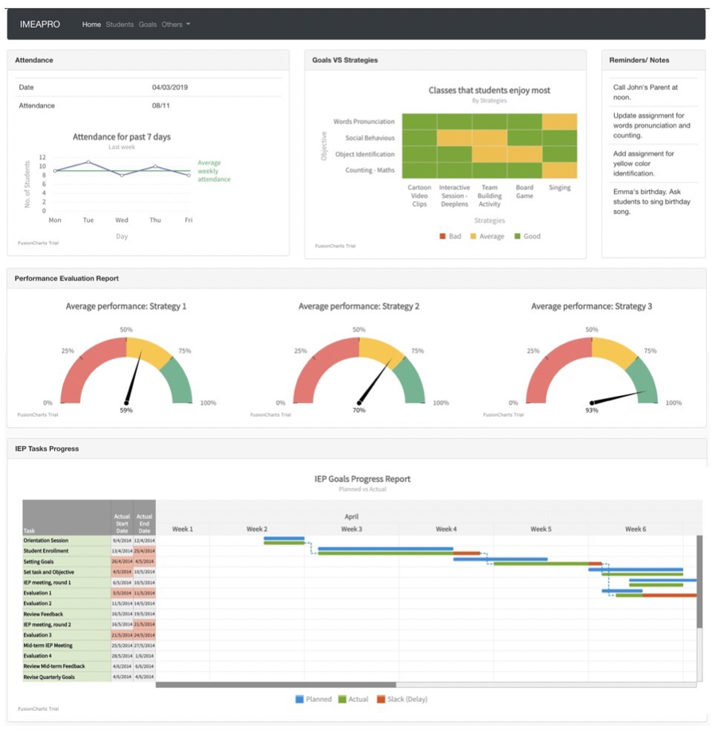
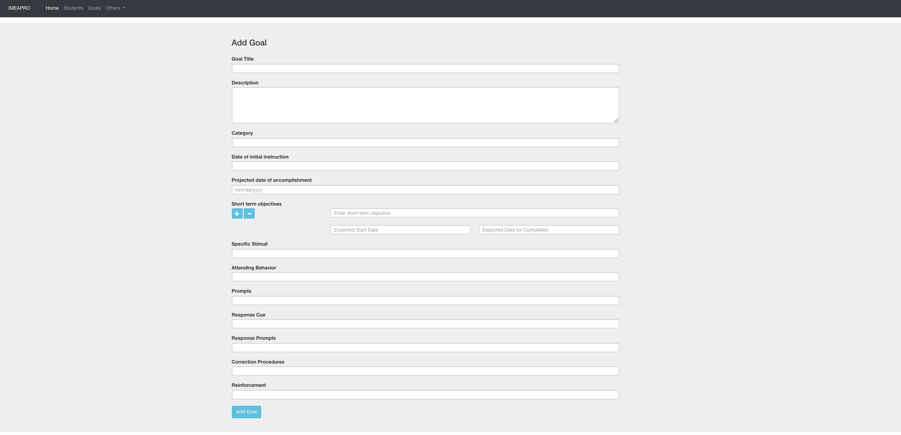
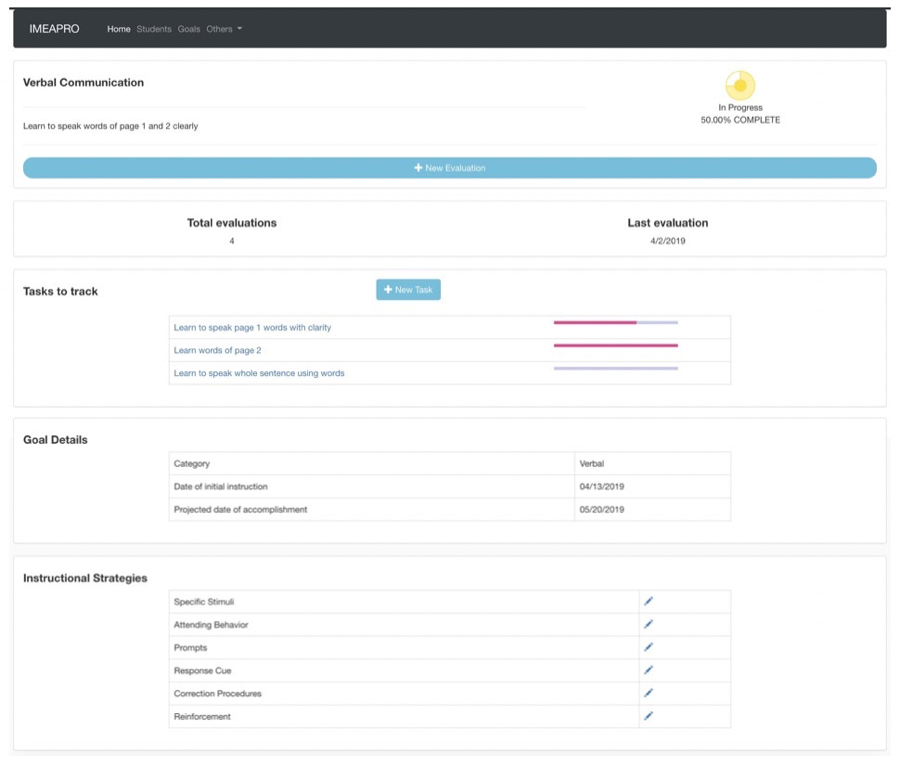
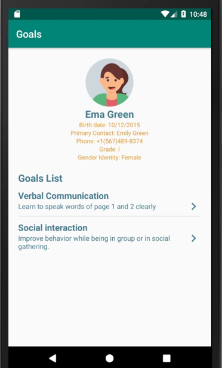
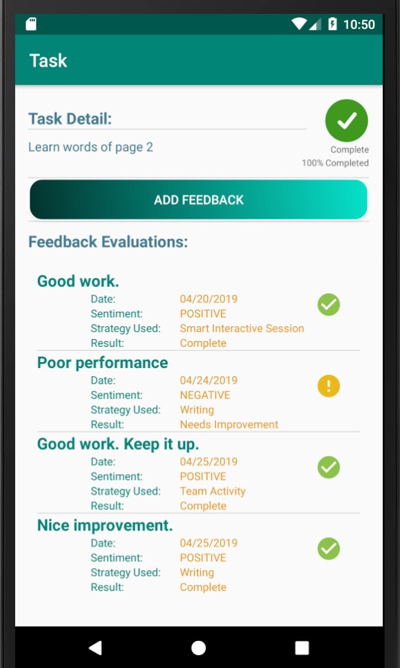

# IMEAPro
Intelligent Monitoring and Evaluation App for Special Children
* Application for monitoring and Logging IEPs
* Behavior and Feedback Analysis
* Conversational interface with Alexa and Deeplens 

## Home Page

            
## Dashboard Page

## Add goals page

## View/Add tasks

## Android-app view goals screen

## Android-app view tasks screen

